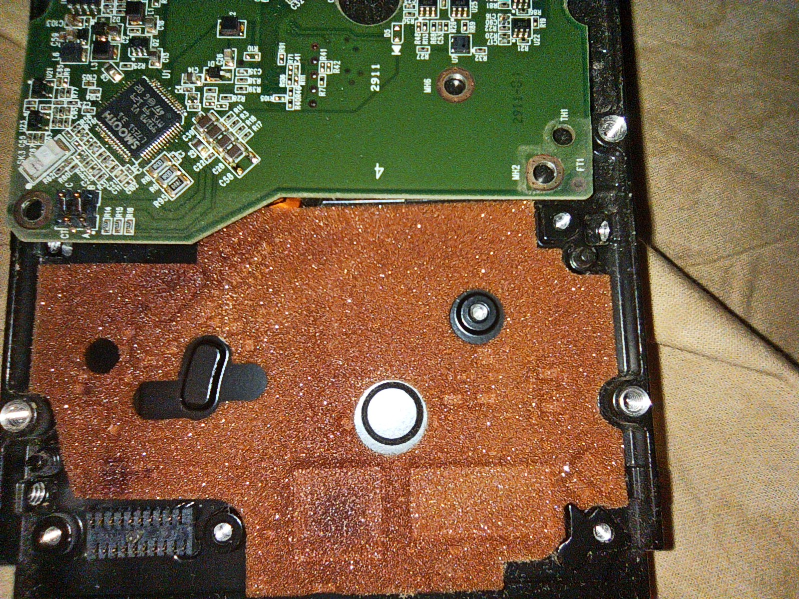
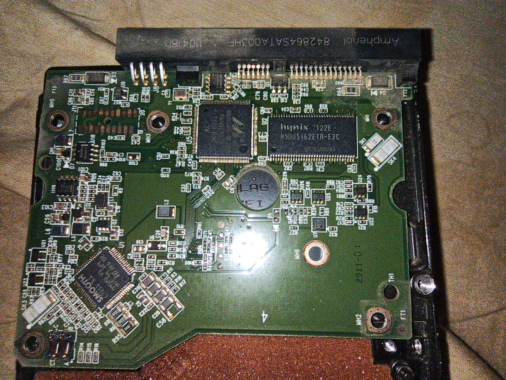
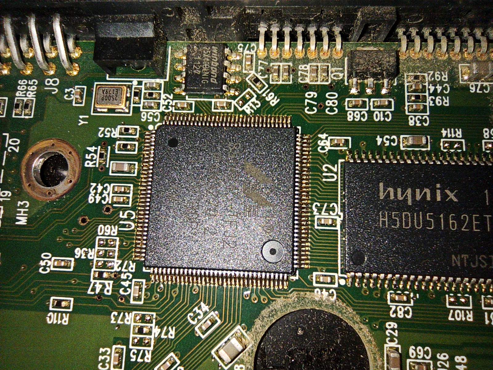
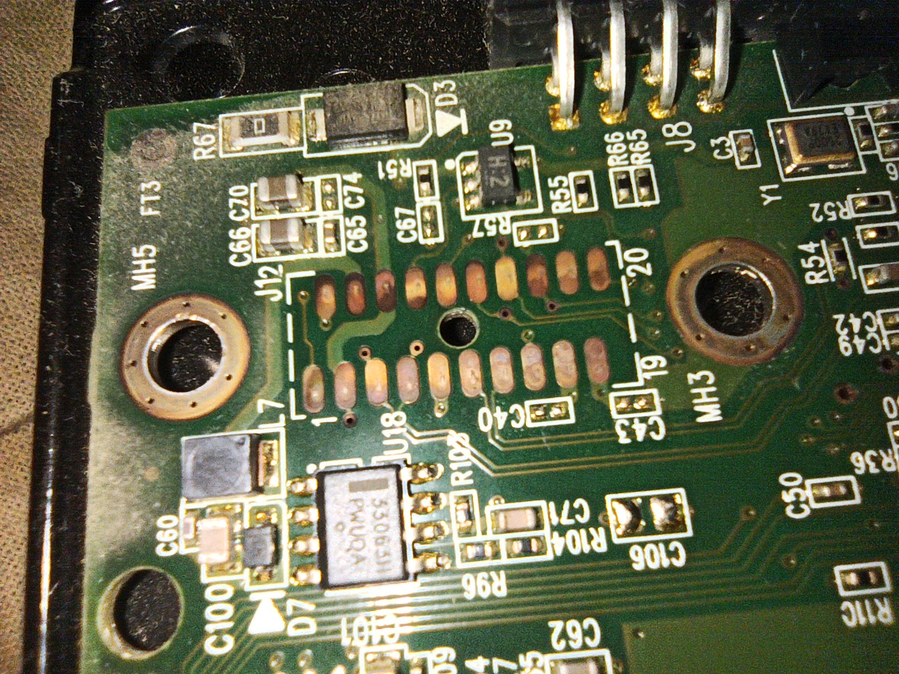
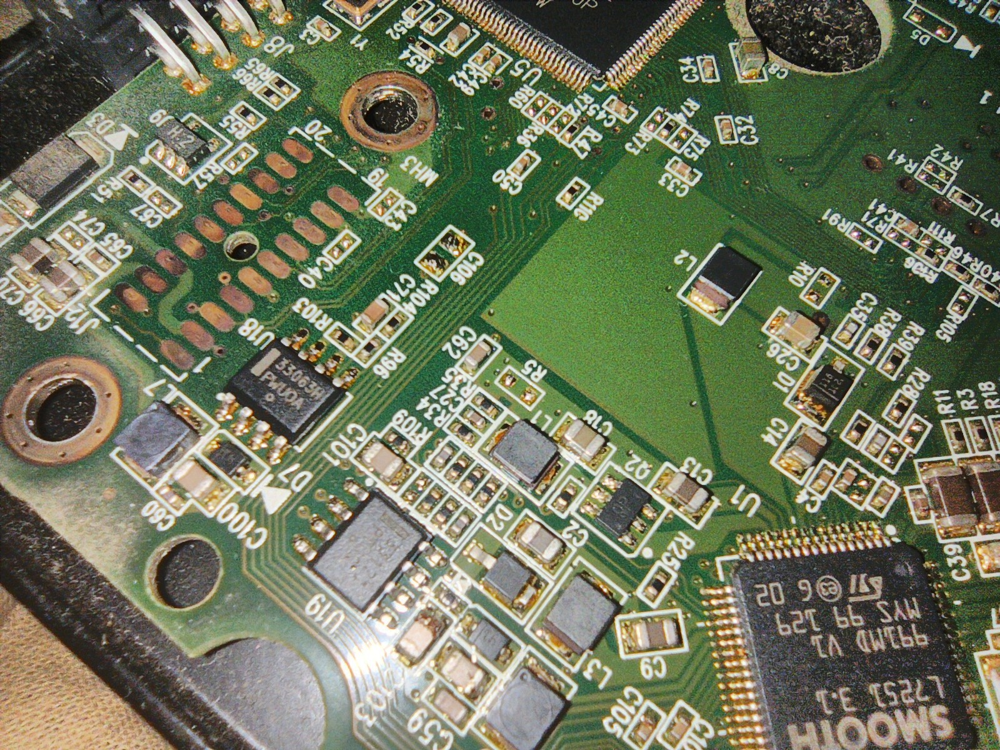
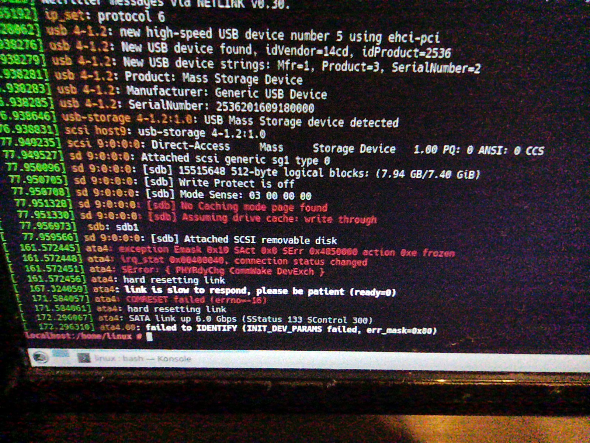
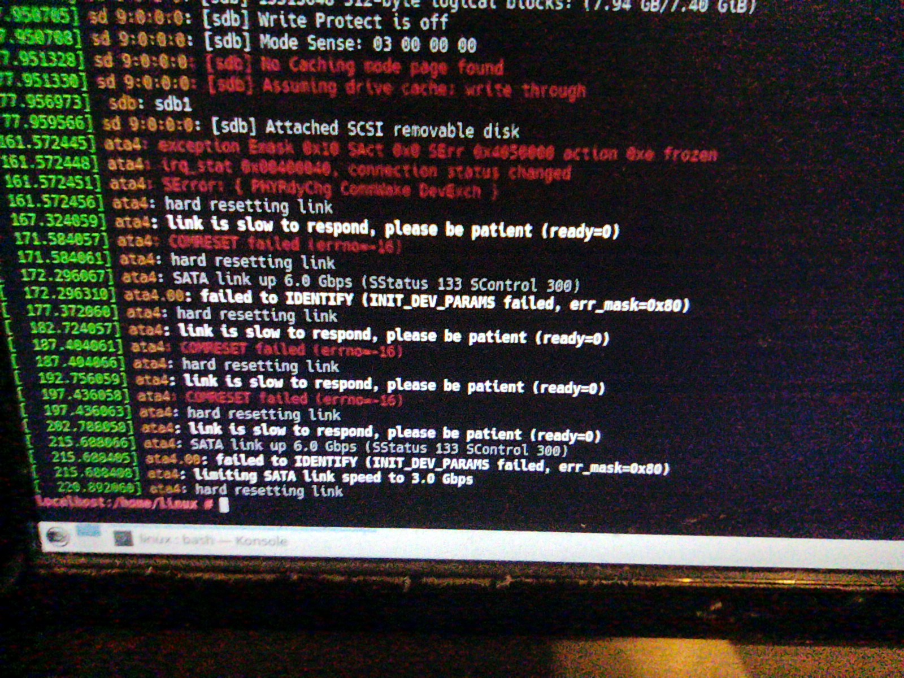

# Спасти жесткий диск HDD Caviar 1002 FAEX

Диск был куплен в далеком 2012-м году, за 10 лет работы на нем все окислилось до черных контактов, но все работало отлично.

Однажды мигнул свет, по всей видимости 2 раза, возможно со скачком по питанию. Блок питания от inwin, тех же лет, похоже забыл про спецификацию ATX.

Предположительно, после пропадания питания, была запущена процедура аварийной парковки. Предположительно, в этот же момент пришелся скачек по питанию, попытался ли винт стартовать заново или окончательно все сдохло - непонятно. Через секунд 10 после остановки, из диска раздался достаточно громкий звук, напоминающий звуки кипящей воды - подозреваю, что головы проехались по блинам.

# Фоточки

Что имеем:

Поролон, напротив основного CPU немного пожарен

Плата, общий вид

Флешка 25х40BLNIG, были заказаны аналогичные 25х40 на Али, вместе с ch341

Контактные площадки окислились достаточно сильно, но видно, что "иглы" процарапали себе контакты, потому скорее всего это не было причиной поломки

Винт само собой в биосе не определяется, не хочет отвечать и на горячее подключение.

# Звуки старта

При подаче питания издает такие звуки 2022_07_09_13_56_09.m4a и sound.mp3 (сделал громче)

# Что сделано

* Почищены контакты на плате, к которым иглами подключается банка - без толку
* Куплены 2 платы с Али
* Куплены 10 флешек
* Куплена CH341 с прищепкой
* Крутанул диск вокруг оси вращения шпинделя - тишина, потом небольшой скрежет - головы не запаркованы, но подшипники целы
* Саму банку пока не открывал, нету чистого помещения, да и боюсь увидеть разлетевшиеся головы.
* Подумываю о покупке набора для пересадки голов с Али.

# Что надо

Надо советов мудрых, чтобы восстановить хотя бы в режиме зомби и слить с него самое интересное. Бекап конечно же есть, но как всегда старый и неполный.
